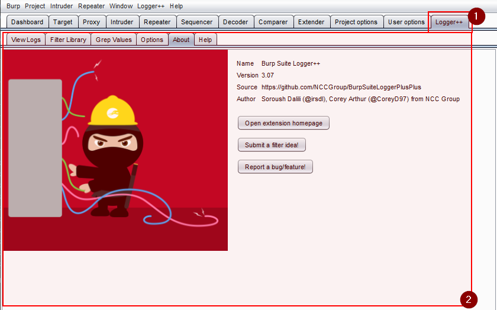
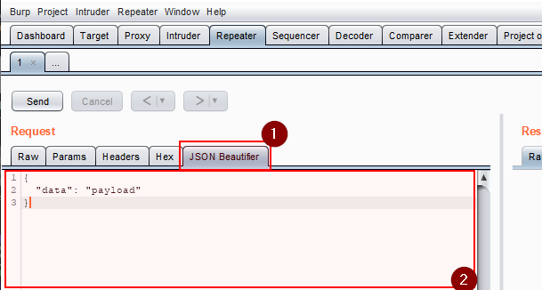
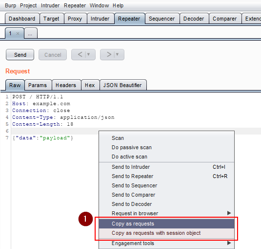
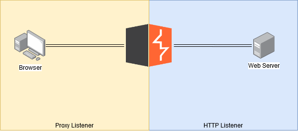
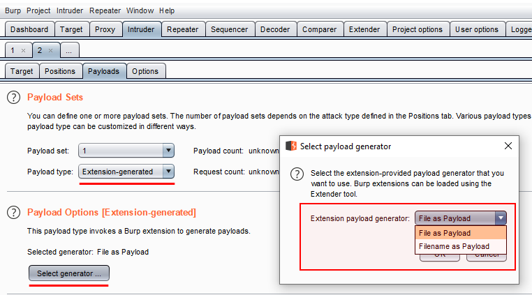
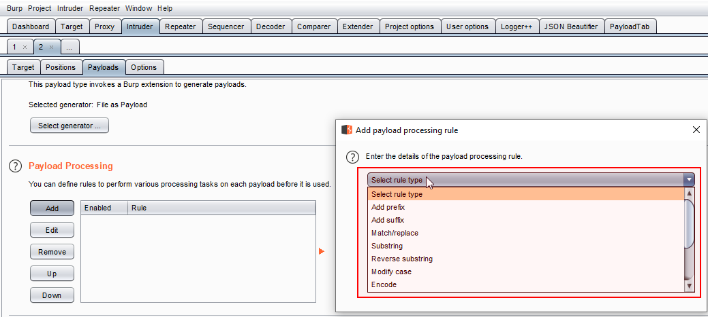
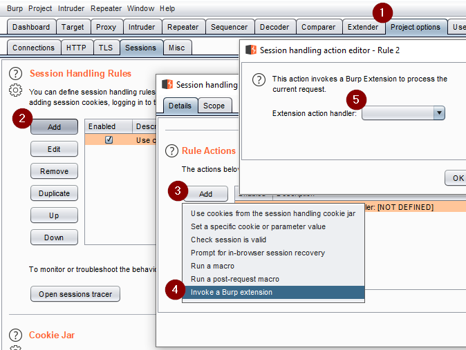

# Burp Extension Generator [![NPM version][npm-image]][npm-url]


## Installation

First, install [Yeoman](http://yeoman.io) and generator-burp-extension using [npm](https://www.npmjs.com/) (we assume you have pre-installed [node.js](https://nodejs.org/)).

```bash
npm install -g yo
npm install -g generator-burp-extension
```

Then generate your new project:

```bash
yo burp-extension
```

## Burp Extension features

When you generate your plugin project, the generator will ask you what
features should be included in your plugin. If you are familiarized with
burp extension developing, the names of the features will be descritive 
enough, but, if you are new in burp extensions, here is a short 
description of what can be done with each feature.

### Extension Tab GUI

Custom tab that will be added to Burp's UI. Normally is used to add some 
functionality (like [logger++](https://github.com/PortSwigger/logger-plus-plus) extension) or just for enabling the user to config the
extension.



### Message Editor Tab GUI

Custom message editor tab that will be added to Burp's Message editor UI (Repeter, Intruder...).
Normally is used to provide some kind of custom editor/view functionality in 
request/response payloads. One example is [JSON Beutifier](https://github.com/PortSwigger/json-beautifier) extension.



### Context menu GUI

Custom context menu will be added to Burp's UI nearly anywhere, by pressing right 
click. Burp allows to show context menus in any of this situations:

- Intruder attack results.
- Intruder payload positions editor.
- Request editor.
- Response editor.
- Non-editable request viewer.
- Non-editable response viewer.
- Proxy history.
- Scanner results.
- Search results window.
- Target site map table.
- Target site map tree.

A simple example of this functionality is [copy-as-python-requests](https://github.com/PortSwigger/copy-as-python-requests) 
extension, that allows to copy a request as python code (just an example).



### HTTP Listener / Proxy Listener

The listener will be notified of requests and responses being processed by the Proxy 
tool (Proxy Listener) or made by any Burp tool (HTTP Listener). Extensions can perform custom analysis or modification of these messages.

In other words, a Proxy Listeners intercept the reques coming from the browser to Burp and the response coming from Burp to the browser. A HTTP Listener intercept outgoing request from burp to the web server and incoming responses comming from the web server.



A real life example plugin using this extension's feature is 
[AutoRepeater](https://github.com/nccgroup/AutoRepeater)

### Intruder payload generator

Extend Intruder payloads adding custom generator capabilities. One posible use of this
functionality could be generate random valid IBAN numbers. One real life example is
the extension [Intruder file payload generator](https://github.com/PortSwigger/intruder-file-payload-generator) (I don't use it, it's just an example)



### Intruder payload processor

Extend Intruder payloads adding custom processor capabilities, one possible example 
could be perform an AES encryption based on a static key.



### Scanner check

When performing scanning, Burp will ask the check to perform active or 
passive scanning on the base request, and report any Scanner issues that 
are identified.

### Scanner insert point provider

When a request is actively scanned, the Scanner will invoke this, 
and the provider should provide a list of custom insertion points that 
will be used in the scan.

### Session Handling action 

Each registered action will be available within the session handling rule 
UI for the user to select as a rule action. Users can choose to invoke an
action directly in its own right, or following execution of a macro.



### Extension state listener

The listener will be notified when extension is unloaded from Burp. 
Note: Any extensions that start background threads or open system 
resources (such as files or database connections) should register 
a listener and terminate threads / close resources when the extension 
is unloaded.

### Scanner Listener

The listener will be notified of new issues that are reported by 
the Scanner tool. Extensions can perform custom analysis or logging 
of Scanner issues by registering a Scanner listener.

### Scope Change listener

The listener will be notified whenever a change occurs to Burp's 
suite-wide target scope.

Probably useless because Burp don't allow you to access global scope
definition.

## Trade-offs

This section explain some decisions in the development of the template.

### Why Java and not Python/Ruby

First of all, I'm not a Java fan

As you might know, BurpSuite allows to develop extensions in three main languages: Java, 
Python and Ruby. Actually this is not entirely true. Burp allows you to develop in Jython
and JRuby. The real problem here is that, when you are using Jython or JRuby in a Burp 
extension you still need to think in Java (because is the main language of Burp), so, at 
the end, you will be developing in Python and Java, but with a lot of problems to integrate
your project with a real IDE, with autocompletion and those kind of modern thins.

Another good reason to use Java instead of Jython is because it is based on python 2.7, and 
I'm not using JRuby because I don't like Ruby, that's all.

### Everything is a Singleton (leading article)

As you might notice, all implementations of a Burp Interface are a following a 
[Singleton pattern](https://en.wikipedia.org/wiki/Singleton_pattern) the main reason for this is
completely subjective.

The thing is that Burp is a great tool, but is a little bit obscure about it's internals
and probably a little bit messy. So, for example, Burp allows you tu register multiple
IHTTPListeners, but you will loose important decisions like the order of calling for this
listeners. This kind of situations, in my humble opinion, might obscure and difficult the 
understanding of a Burp Extension and code maintainability.

You can see each singleton class as a necessary connection point with Burp, that must be 
unique. From that point of connection, you can control your code, performing any kind of
object oriented design.

## License

MIT © [Raul Sampedro](https://github.com/rsrdesarrollo)


[npm-image]: https://badge.fury.io/js/generator-burp-extension.svg
[npm-url]: https://npmjs.org/package/generator-burp-extension

